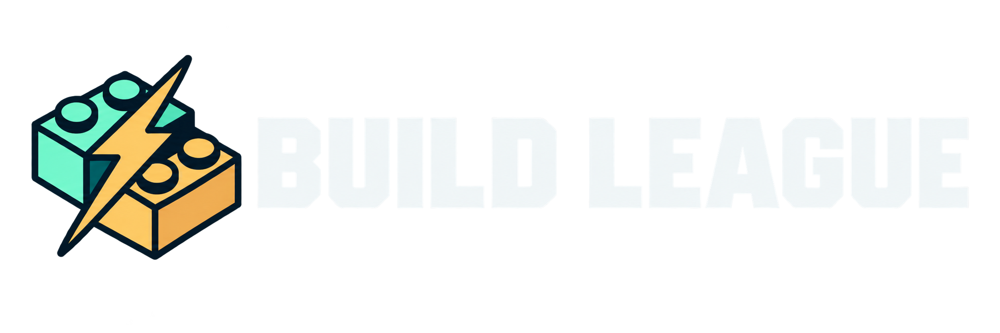

<p align="center">
  
</p>

# Build League

Build. Test. Improve. A home for hands-on team engineering challenges at
**East Bay Makers Club**.

## Generator challenge

Teams design fan blades for a tiny generator, test them under the same conditions,
and compete for the highest **peak voltage**. The first project is
[Blade Lab](generator-dashboard/): a local web dashboard that makes the results
visible to everyone.

- Live voltage graph with a fixed **0–1.2 V** scale.
- Large voltage and **30-second peak** readouts, plus full-screen mode.
- **Reset graph & peak** to clear the live view without deleting saved attempts.
- Timed team attempts, ranked by peak voltage. Stopping early does not penalize a run.
- Saved traces, side-by-side graph comparisons, and CSV downloads.
- Direct encrypted connection to an ESPHome reader over Wi-Fi; no cloud hosting required.

The dashboard displays roughly five averaged readings per second. The ESP32 is
configured to sample every 1 ms and average 200 samples before reporting; our
initial test measured approximately 960 samples per second and 4.8 updates per
second. The dashboard consumes those averages, not the raw ADC stream.

## Quick start

Requires Python 3.12+ and Node.js 22.13+, plus a reachable ESPHome Voltage Reader.

```sh
git clone https://github.com/eastbaymakersclub/buildleague.git
cd buildleague/generator-dashboard
python3 -m venv .venv
.venv/bin/pip install -r requirements.txt
npm ci
cp esphome/secrets.example.yaml esphome/secrets.yaml
```

Edit `esphome/secrets.yaml` and set `api_encryption_key` to the reader's existing
ESPHome API encryption key. For an already-flashed reader, the other values are
only needed if you will also compile or flash the firmware. Never commit this file.

The reader defaults to `voltage-reader.local`. If local discovery does not work,
set its IP address explicitly:

```sh
export GENERATOR_HOST="192.168.1.123"  # replace with your reader's address
npm run build
.venv/bin/python launch.py
```

Open **[127.0.0.1:5173](http://127.0.0.1:5173/)**. On macOS, after the initial setup,
you can also double-click **Start Blade Lab.command**. Keep the launcher window
open for the competition; Control-C stops it. When launching from Finder, export
any host override in your shell setup or launch from the terminal instead.

Results stay in `generator-dashboard/data/`, and logs stay in
`generator-dashboard/logs/`. Neither is committed. The server listens only on
this computer, and the ESPHome key never goes to the browser. An optional
`ESPHOME_SECRETS` environment variable can point to an existing secrets file.

## Hardware and scoring

The reference reader is an **Adafruit HUZZAH32 ESP32 Feather**:

| Connection | Feather pin |
| --- | --- |
| Generator signal / positive | A2 (GPIO34) |
| Generator ground / negative | GND |
| Power | USB |

Use low-voltage DC only. **Keep the input between 0 and 3.3 V**; never connect
negative voltage or mains. The useful direct measurement range is approximately
0.1–3.1 V, even though the dashboard graph is zoomed to 1.2 V. An unconnected input
floats. The plotted line is capped at the graph's upper edge; the numerical
readout and saved results retain the measured value.

Keep the fan position, fan speed, and electrical load the same for every team.
This challenge scores **voltage**, not measured power. To compare power, use a
known electrical load or add current measurement.

Completed and early-stopped attempts are ranked together within their selected
attempt length. Interrupted and potentially range-limited attempts are saved but
not ranked. Losing the feed interrupts an active run instead of filling in a
winning score with stale data.

## What's here

```text
generator-dashboard/
  app/                      Web dashboard
  public/                   Build League logo and generation prompt
  server.py                 ESPHome reader, live stream, and saved attempts
  launch.py                 Local launcher and service supervisor
  Start Blade Lab.command   macOS double-click launcher
  esphome/                  Voltage reader and large-display firmware
  homeassistant/            Optional voltage-to-display automation
  test_server.py            Recording, persistence, reset, and API checks
```

The [ESPHome guide](generator-dashboard/esphome/README.md) covers the firmware and
optional six-digit display. The [dashboard guide](generator-dashboard/README.md)
explains operation and development.

The Build League logo was made with built-in image generation; its
[original prompt](generator-dashboard/public/build-league-logo.prompt.md) and
[transparent PNG](generator-dashboard/public/build-league-logo.png) are included.

## Checks

From `generator-dashboard/`:

```sh
.venv/bin/python -m unittest -v test_server
npx tsc --noEmit
npm run lint
npm run build
```
