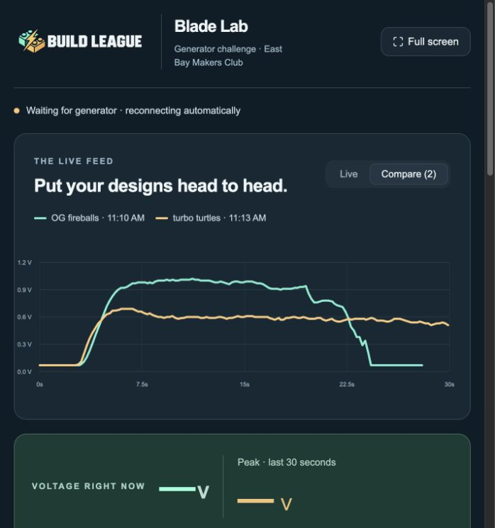

# Blade Lab

A local live voltage graph and team-trial dashboard for the tiny-generator blade
competition. It connects directly to the existing ESPHome Voltage Reader over its
encrypted Wi-Fi API. Home Assistant and the large display continue working.



Compare saved attempts on the fixed 0–1.2 V scale, even while the generator is disconnected.

## First-time setup

Follow the repository [setup instructions](../README.md#quick-start) to install
dependencies, configure your ESPHome API key, and build the dashboard.

## Open it

Double-click **Start Blade Lab.command**, or open <http://127.0.0.1:5173/> when it
is already running. Keep the launcher terminal open during the competition.
Control-C stops the reader and web server; saved attempts remain on disk.

The dashboard is bound to this computer only. No sign-in or cloud hosting is used.
Wi-Fi access to the Feather is required. No readings or keys are sent to a remote
service. The key is read on the server from the existing ignored ESPHome secrets
file; it is never embedded in the webpage.

## Run the competition

1. Keep the fan position, fan speed, and electrical load the same for each team.
2. Install the team's blades and let the generator start spinning.
3. Enter the team / blade design and choose 15, 30, or 60 seconds.
4. Start the attempt. It stops and saves automatically.
5. Select saved attempts to overlay their graphs. Download a CSV of each run.

The score is **peak voltage**, and the table is sorted highest peak first.
Time-weighted average voltage is also shown. Rankings compare completed or early-stopped
attempts with the currently selected duration. Stopping early does not penalize
the score. Interrupted and range-limited attempts stay visible but are not ranked. Losing the device or
receiving no samples for two seconds interrupts the run instead of inventing a
continuous trace. The live plot also shows breaks across missing data.

The live readout includes a prominent rolling peak over the last 30 seconds.
**Reset graph & peak** clears the live history and peak in every open dashboard;
new readings start filling the graph immediately. Saved attempts are preserved.
Reset is disabled during an active attempt so its recording is not disturbed.
The fixed graph scale is 0–1.2 V. The ADC has a smaller useful measurement range,
roughly 0.1–3.1 V; readings at 3.1 V and above are marked as potentially clipped.
Never apply more than 3.3 V or a negative input to A2. An unconnected input floats.
This is voltage, not measured power: power comparisons require a defined load or
current measurement. The graph uses the existing approximately 5 Hz averaged
readings, not the individual approximately 1 kHz ADC samples.

## Files and configuration

- `data/run-*.json`: saved attempts, including every averaged reading.
- `data/active.json`: periodic checkpoint for an ongoing attempt. On restart it is
  recovered as interrupted. Up to about one second may be absent after a crash.
- `logs/`: local reader and web-server logs.
- `GENERATOR_HOST`: optional environment override, default `voltage-reader.local`.
- `ESPHOME_SECRETS`: optional path override, default
  `esphome/secrets.yaml` (key `api_encryption_key`).

The Feather's address must stay reachable; update GENERATOR_HOST if DHCP changes
it. The browser automatically reconnects to the local stream, and the reader
retries connections to the Feather. Browser reloads do not stop server-side runs.

## Development / rebuild

Requires Python 3.12+ and Node.js 22.13+.

```sh
python3 -m venv .venv
.venv/bin/pip install -r requirements.txt
npm ci
npm run build
.venv/bin/python launch.py
```

For live development, run `.venv/bin/python server.py` and `npm run dev` in separate
terminals. Stop the production launcher first to free ports 8766 and 5173.

```sh
.venv/bin/python -m unittest -v test_server
npx tsc --noEmit
npm run build
```

The frontend also exposes optional WebMCP tools for reading results and starting
or stopping an attempt in supporting browsers. The ordinary interface works
without WebMCP. These tools were not browser-validated in this session.
